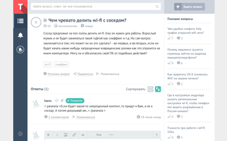

Toster: Simplified Sidebar
--------------------------

Стиль исправляет &laquo;тяжёлую&raquo; левую панель интерфейса Тостера, делая её менее заметной и приковывающей внимание:

* крепит панель к краю экрана;
* убирает цвета и фон, делая её чёрно-белой;
* добавляет полупрозрачность (не при наведении);
* восстанавливает прежний вид при раскрытии одного из меню.

Кроме того, стиль может сделать фон страницы однородным (белым).

Минимализм делает пространство страницы просторнее.

Пример: [было](README.d/original.big.png), [стало](README.d/screenshot.big.png).

&rarr;

